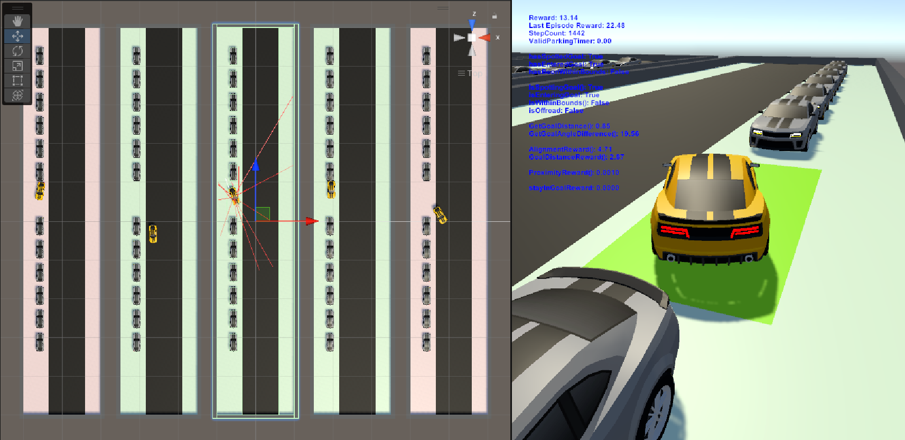

# Deep Reinforcement Learning for Parallel Parking Agents with Unity



<p align="center">View the YouTube demonstration video <a href="https://youtu.be/rVUy_hzVhqI" target="_blank">here</a>.</p>

### Abstract

*Taken from the Coursework Report.*

This project aims to train a car-driving agent to excel at parallel parking using deep reinforcement learning techniques. The agent is tasked with meeting time-bound goals, demonstrating accuracy and precision in parking, and maintaining safety by avoiding collisions. The training process involves multiple phases, gradually increasing the complexity of the tasks and environments. Unity, a versatile game development platform with ML-Agents support, is chosen as the development environment due to its user-friendly tools and flexible algorithm configuration.

The agent exhibited significant improvement in the later stages of training, particularly in Phases 7 and 8. Despite limitations in vision, the agent consistently achieved high scores comparable to human performance. The tuning of reward functions and parameters played a crucial role in shaping the agent's behaviour. The inclusion of modules like Curiosity and GAIL proved beneficial for exploration and imitation learning, resulting in interesting emergent behaviour. Fine-tuning the modules in later phases allowed the agent to optimise its performance based on extrinsic rewards, leading to consistently high scores.

### Student Details

| Field        | Details             |
|--------------|---------------------|
| Student Name | Ian Chong Zhen Ming |
| Student ID   | 20313229            |
| Date         | 17 May, 2023        |

---

## Project Structure

All important project files are stored under the `Assets` folder. The project structure showing the most significant files can be seen below.

```txt
Assets/
    ML-Agents/
        results/
            phase*
    Scenes/
        *.unity
    Scripts/
        CarAgent.cs
        CarController.cs
        CarFollowCam.cs
        CarParked.cs
        ParkingGoal.cs
        ParkingLots.cs
        SceneConfig.cs
        SimulationManager.cs
        UIVariables.cs
```

`ML-Agents/results` contains the graphs generated during training for each training phase, showing change of reward, policy, entropy and many other metrics over time.

`Scenes/` contains the Unity game environments for training the agents. These can only be inspected through the Unity Editor.

`Scripts/` contain core game logic and exists as `.cs`, C# source code files.

### Scripts

`SimulationManager.cs` is the heart of the training environment. All game rules, game states, reward functions and calculations are performed in this script. It monitors the agent and assigns rewards and penalties at each step of the game. It contains many environment parameters that can be tuned from the Unity Editor.

`CarAgent.cs` communicates with the Python `mlagents-learn` instance that runs during training. The float and discrete values from the neural network are passed into the `OnActionsReceived` method which is then delegated to `CarController` to move the car. Observations are also collected here, such as the velocity and target direction vector.

`CarController.cs` is the script that translates float and integer inputs into car movement. It handles physics updates when the user wishes to apply forces to drive, brake or steer the car.

The other scripts are helpers to communicate between nested hierarchies of GameObjects in Unity.

---

## Environment Setup

This is a Unity project using ML-Agents. It is highly recommended to check out the [Unity ML-Agents GitHub Toolkit repository](https://github.com/Unity-Technologies/ml-agents) for more information.

### Prerequisites

First, download and install **Unity Hub** from the [official Unity download site](https://unity.com/download). It is a management tool for Unity projects that allows you to manage different versions of Unity Editors.

From Unity Hub, install **Unity Editor LTS 2021.3.24f1** for compatibility with this project. You may also be prompted to install Visual Studio, the .NET framework and other C# development dependencies.

Install **CUDA Version 11.8** or higher (the one used for this project is 12.1). This is required to leverage GPU acceleration during training.

Finally, install **Python 3.9.16** in your virtual environment, which is the version required for further dependencies to be installed. Using Conda is highly recommended.

```sh
conda create -n unity python=3.9.16
conda activate unity
```

### Dependencies

In your Conda environment, install `pytorch` with the `conda` package manager. Please refer to the [Pytorch getting started guide](https://pytorch.org/get-started/locally/) for the most up-to-date command to use.

```sh
conda install pytorch torchvision torchaudio pytorch-cuda=11.8 -c pytorch -c nvidia
```

Install version 0.30.0 of the `mlagents` Python package.

```sh
python -m pip install mlagents==0.30.0
```

This project met some errors with the packages installed, so the following commands were run.

```sh
pip install protobuf==3.20
conda install onnx
```

Running `mlagents-learn` in your terminal should now show a Unity splash screen.

Next, clone the `ml-agents` repository and switch to the Release 20 tag. This folder contains the `ml-agents.extensions` package that may be required for ML-Agents projects.

```sh
git clone https://github.com/Unity-Technologies/ml-agents.git
cd ml-agents
git checkout tags/release_20 -b release_20
```

---

## Starting the Project

Clone this repository to your local machine.

```sh
git clone https://github.com/ianczm/unity-dia-project.git
```

Launch Unity Hub and select the project folder to open. This should launch the Unity Editor and automatically proceed with the setup. You may be required to manually install the `ml-agents.extensions` package using the Package Manager.

---

## Usage

Under the `Assets/Scenes` folder are the environments for the different phases. Use the `SceneConfig` GameObject to configure whether you would like to conduct training, play by hand or connect an ONNX neural network model for inference.

To view results obtained during the course of this project, launch Tensorboard.

```sh
tensorboard --logdir Assets/ML-Agents/results
```


